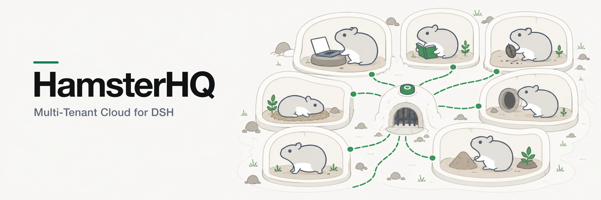
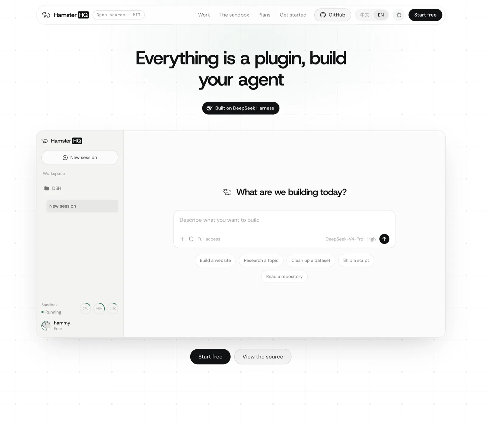

# HamsterHQ

English | [中文](README.zh.md)

Project page: **<https://huchundong.github.io/HamsterHQ/>** — what it is, in one page.

Project introduction: [Read the WeChat Official Account article](https://mp.weixin.qq.com/s/lDd3rK6syoCB7TANxwCRsQ)

> [!IMPORTANT]
> **Independent project notice:** HamsterHQ is an independently developed,
> unofficial project. **HamsterHQ and DSH are not products of the same company
> or organization.** This repository is not affiliated with, sponsored by,
> endorsed by, or maintained by DeepSeek AI, the `deepseek-ai` organization,
> Tencent Cloud, or the maintainers of DSH or CubeSandbox. Their names are used
> only to identify interoperability and upstream dependencies; this project
> claims no ownership of their names, logos, or trademarks.

A multi-tenant cloud deployment of [DSH](https://github.com/deepseek-ai/deepseek-harness):
an independently deployed frontend, an authenticating gateway, and one dsh
backend per logged-in user, each with its own persistent volume.

DSH itself is a dependency, installed from npm. Aside from the one
build-gated patch in `web/patch-loopback.mjs`, the harness is not modified.
What this project adds to it, it adds as cordis plugins.



## Architecture



Four decisions carry the design:

- **Sandboxes attach outbound.** A tenant's backend never accepts a connection
  — it dials the gateway and serves `/api` back over that socket. No inbound
  reachability, no published port, no change to dsh's loopback binding.
- **The gateway authenticates tenants.** DSH separately authenticates its local
  browser connection; the tunnel obtains that session from DSH itself. Every `/api`
  request, HTTP and WebSocket alike, resolves to a session before it reaches a
  tunnel.
- **One tenant per process.** dsh's `/api` surface is single-occupancy and its
  session store is process-wide, so isolation is machine isolation: a microVM
  under CubeSandbox, a container under the Docker simulation.
- **Every tenant spends their own model key, and none of them holds it.** Keys
  are claimed at registration from a pool the operator loads; under CubeSandbox
  the sandbox holds a placeholder and CubeEgress substitutes the real key in
  flight, so a prompt injection has nothing to read back.

Two seams keep those decisions portable: `cube` and `docker` differ only in how
a machine is created and reclaimed, and DSH stays a pinned npm dependency whose
additions — the tunnel, the remote host surface, the tenant account, the
computer handoff, the artifact panel, scheduled tasks, and the brand — are
cordis plugins resolved by name.

[docs/design.md](docs/design.md) has the reasoning behind each of these and the
alternatives they replaced. [docs/sandbox-pitfalls.md](docs/sandbox-pitfalls.md)
records what broke on the way there — the symptom, the measurement, and the
wrong conclusion that came first.

## Repository layout

```
Dockerfile              every image, from one npm install
compose.yml             the stack, with overlays for CubeSandbox and real TLS

gateway/                the gateway image — sessions, accounts, routing
admin/                  the operator's console — its own image, its own port,
                        its own credential; shares the gateway's modules and
                        can reach no sandbox
web/                    the web image — nginx, the landing page, and the
                        harvested frontend shell
sandbox/                the sandbox image — entrypoint, and what the dsh
                        composition adds and strips

packages/               the npm packages this repository owns
  tunnel-protocol/        the frame protocol both ends of the tunnel speak
  dsh-gateway-tunnel/     cordis plugin: a sandbox's /api traffic, carried out
  dsh-sandbox-host/       cordis plugin: what a browser needs when the backend
                          is on another machine — uploads, and the settings
                          document read rather than opened
  dsh-computer/           cordis plugin: the shared browser/desktop, live
                          preview, and human-action handoff card
  dsh-tenant-account/     cordis plugin: who is signed in, and how to stop
  dsh-artifact-panel/     cordis plugin: the workspace beside the conversation
                          — files, viewers, a terminal and a canvas
  dsh-scheduled-tasks/    cordis plugin: the tenant's durable schedule and the
                          timers/tools that fire it inside a sandbox
  dsh-brand/              cordis plugin: this deployment's marks inside the
                          shell
  dsh-icons/              one icon set for the surfaces that cannot ask the
                          shell for one
  dsh-ground/             the lattice the gateway's pages and the landing page
                          are both drawn on

integrations/           stands alone; could leave without changing a line here
  cube-volume-juicefs/    a CubeSandbox VolumePlugin backed by JuiceFS over S3

docs/                   the design, the brand, and what a sandbox will trip on
verify/                 the acceptance suite — needs a deployment
scripts/                repository gates — `npm run check` runs the whole list
dev/                    the development mailbox, so a sign-in code can arrive
vendor/                 third-party build artifacts; licenses and origins in NOTICE
```

[AGENTS.md](AGENTS.md) is the development contract: DSH stays a dependency
(unmodified except for the one gated loopback patch), everything added to it
is a cordis plugin, and each directory above admits only what belongs in it.

`SANDBOX_RUNTIME` selects the runtime: `cube` for
[CubeSandbox](https://github.com/TencentCloud/CubeSandbox), where each tenant
gets a microVM, and `docker` for the simulation a laptop can run.

## Running it

```sh
cp .env.example .env      # set SESSION_SECRET, POSTGRES_PASSWORD, RESEND_API_KEY
docker compose --profile build build
docker compose up -d
open http://localhost:8080
```

That is the Docker simulation: one container per tenant, everything on one
machine, nothing to install but Docker. The three variables named above are the
required block in `.env.example` and the stack refuses to start without them.
The sandbox image is built but never started by compose — the gateway starts
one per tenant — so the first request after a login waits for that container
and for dsh to boot.

**Production runs the other runtime**: one microVM per tenant under
CubeSandbox, which is also what keeps the model credential out of the sandbox.
That needs a CubeSandbox installation of its own — see
[docs/cubesandbox.md](docs/cubesandbox.md).

The public face of a deployment — what `/` answers for anyone without a
session, how it is built and where its marks come from — is
[docs/landing.md](docs/landing.md).

## Verifying it

```sh
npm run verify        # the Docker simulation; see docs/cubesandbox.md for the other
```

Two tenants sign in and the suite checks what the deployment exists to provide:
unauthenticated calls are refused, each tenant gets their own sandbox, neither
can reach the other's sessions, and a real model turn completes in a real
browser. It spends real model tokens and removes every sandbox, so never point
it at a deployment people are using. [docs/design.md](docs/design.md#verifying-it)
covers what each suite exists to catch.

## Known limitations

- **Sessions outlive a gateway restart; sandboxes do not.** Signing in survives
  a redeploy because sessions live in Postgres, but every sandbox is reaped at
  boot. With volumes on, the tenant's files and history come back with the next
  sandbox and only the conversation in flight is lost.
- **One gateway replica.** Postgres removes the gateway's disk state, not its
  state: the live tunnels are WebSockets the sandboxes dialled to one process,
  so a second replica could not serve a tenant whose sandbox reached the first.
- **An invite is a bearer token.** Anyone holding an unused code can register,
  including whoever it was forwarded to. It is single-use and recorded against
  the address that spent it, which makes that visible after the fact rather
  than preventable.
- **Revocation takes up to fifteen minutes.** An access token is a signed JWT
  the gateway verifies without asking anything, which is what keeps `/api` off
  the store. Signing out, suspension and deletion revoke the refresh token at
  once, so the account cannot renew — but a token already in a browser lasts
  out its term.
- **The Docker simulation is a simulation.** Nothing is persisted, and the
  model credential sits in the sandbox's environment where the agent can read
  it: there is no CubeEgress in front of a container to put it back.
- **The gateway holds the Docker socket**, which is host-root-equivalent. It is
  why the gateway runs no tenant code and exposes nothing an authenticated
  request can steer beyond starting that tenant's own sandbox.

## Licence

MIT, in [LICENSE](LICENSE). Third-party material redistributed with this
project is listed in [NOTICE](NOTICE), with the license texts in
[`licenses/`](licenses/). The fonts in `web/landing/fonts/` (Host Grotesk,
DM Sans, Fragment Mono) are under the
[SIL Open Font License](https://openfontlicense.org). The icons in
`packages/dsh-icons/` come from the upstream harness (MIT) and from
lucide-static (ISC; `terminal`, `minimize-2`, and `log-out` are also under
the Feather MIT license).

## Upstream projects and acknowledgments

HamsterHQ relies on and is grateful to the maintainers and contributors of:

- [DeepSeek Harness (DSH)](https://github.com/deepseek-ai/deepseek-harness),
  the upstream agent harness installed by this project as an npm dependency.
  DSH is distributed under its [MIT License](https://github.com/deepseek-ai/deepseek-harness/blob/master/LICENSE).
- [CubeSandbox](https://github.com/TencentCloud/CubeSandbox), the optional
  microVM sandbox runtime used to provide per-tenant isolation. CubeSandbox is
  distributed under [Apache-2.0 with the third-party notices listed in its license](https://github.com/TencentCloud/CubeSandbox/blob/master/LICENSE).

Each upstream project remains governed by its own license and maintainers.
Acknowledgment here does not imply affiliation, sponsorship, endorsement, or
joint ownership.
