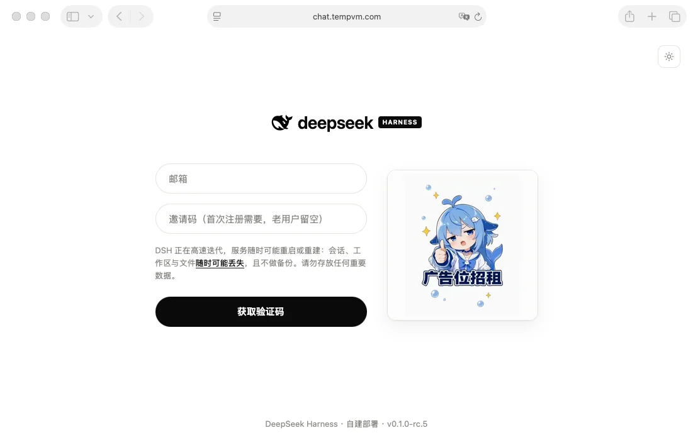
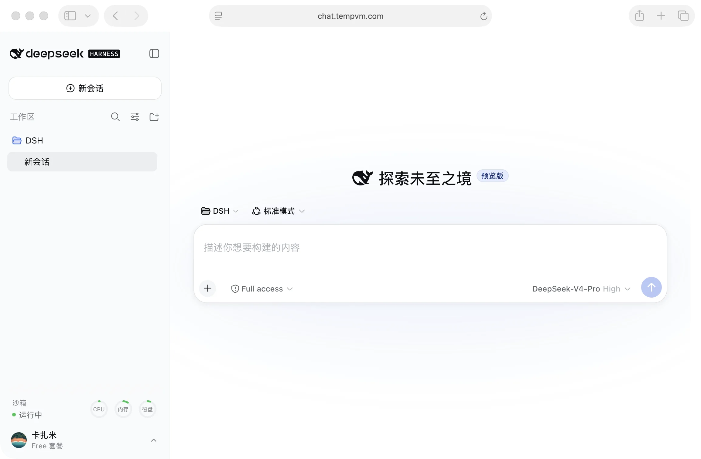
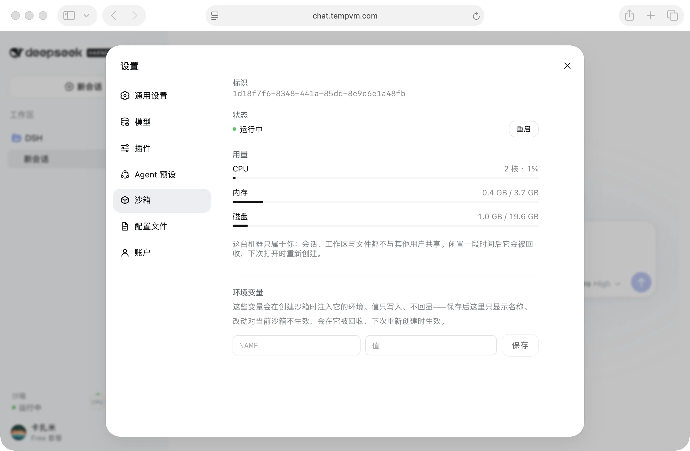
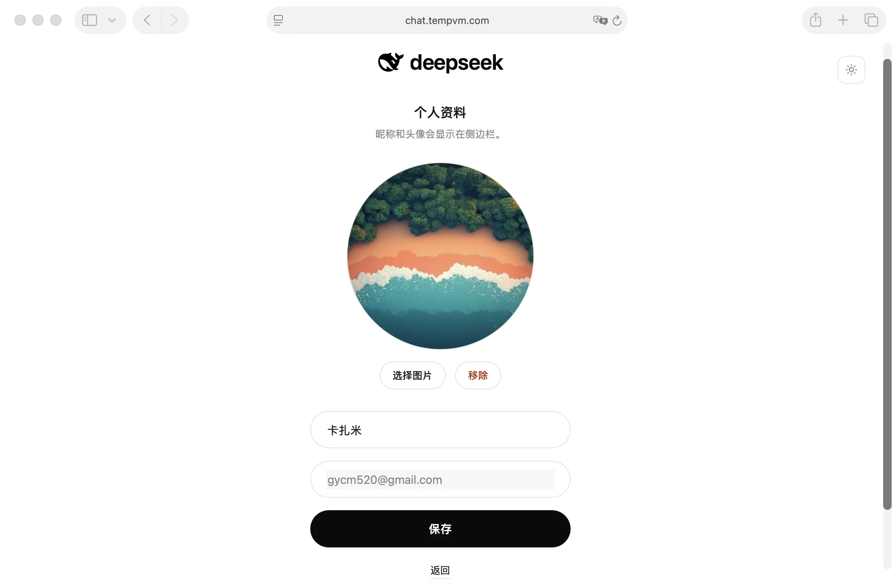
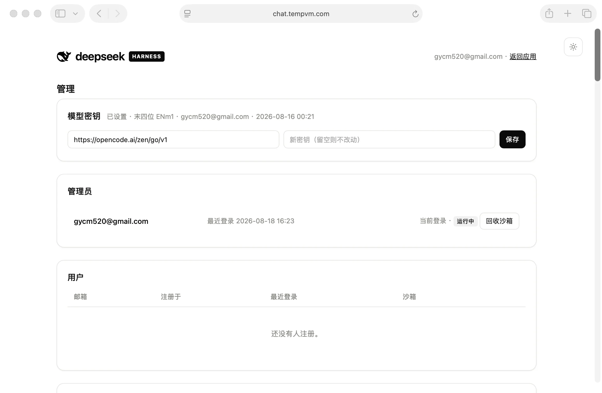

# HamsterHQ

English | [中文](README.zh.md)

Project page: **<https://huchundong.github.io/HamsterHQ/>** — what it is, in one page.

Project introduction: [Read the WeChat Official Account article](https://mp.weixin.qq.com/s/lDd3rK6syoCB7TANxwCRsQ)

> [!IMPORTANT]
> **Independent project notice:** HamsterHQ is an independently developed,
> unofficial project. **HamsterHQ and DSH are not products of the same company
> or organization.** This repository is not affiliated with, sponsored by,
> endorsed by, or maintained by DeepSeek AI, the `deepseek-ai` organization,
> Tencent Cloud, or the maintainers of DSH or CubeSandbox. Their names are used
> only to identify interoperability and upstream dependencies; this project
> claims no ownership of their names, logos, or trademarks.

A multi-tenant cloud deployment of [DSH](https://github.com/deepseek-ai/deepseek-harness):
an independently deployed frontend, an authenticating gateway, and one dsh
backend per logged-in user, each with its own persistent volume.

DSH itself is a dependency, installed from npm. Aside from the one
build-gated patch in `web/patch-loopback.mjs`, the harness is not modified.
What this project adds to it, it adds as cordis plugins.

## Screenshots

### Invite-only sign-up



### Per-tenant DSH workspace

The sidebar's foot carries what belongs to the person rather than to the
session: their sandbox's state and load, and themselves.



### The machine is theirs to see and to configure

Its identity, its state, what it is using against what it was given, and the
environment variables the next one will start with.



### A name and a face

Chosen on the way in, and shown in the sidebar afterwards.



### The operator's console

Its own deployment, its own hostname, its own credential — a username, a
password, and a second factor enrolled by scanning a square in the console
itself. Nothing on the tenants' side links to it. Accounts, tiers, invite codes
and the model credential live here.



## Architecture


Four decisions carry the design; the rest follows from them.

**Sandboxes attach outbound.** A tenant's backend never accepts a connection —
it dials the gateway and serves `/api` back over that socket. No sandbox needs
inbound reachability, a published port, or a change to dsh's default loopback
binding, and the gateway allocates every stream id on the tunnel, which makes
addressing another tenant's stream unrepresentable rather than merely forbidden.
It also preserves the loopback-pinned configuration surface — `settings.*`,
`credentials.*`, `agentPreset.*` — because the tunnel client replays each
request across the sandbox's own loopback interface.

**The gateway is the only authentication boundary.** dsh ships none, and the
agent behind it runs shell commands with full access on the tenant's behalf.
Every request under `/api`, HTTP and WebSocket alike, resolves to a session
before it can reach a tunnel. A signed JWT keeps the session store off the hot
path; a rotating opaque refresh token in Postgres is what makes revocation real.

**Occupancy is one tenant per process.** dsh has no tenant concept — its `/api`
surface is single-occupancy and its session store is process-wide — so
multiplexing two tenants into one backend would be a correctness defect, not an
optimization. Isolation is machine isolation: a microVM under CubeSandbox, a
container under the Docker simulation.

**Every tenant spends their own model key, and none of them holds it.** The
deployment names one model route; each tenant claims a key for it at
registration from a pool the operator loads, so a spend is attributable and
capped without this project running a billing plane. Under CubeSandbox the
sandbox holds a placeholder and CubeEgress substitutes that tenant's real key
into the `Authorization` header in flight. Anything in a sandbox's environment,
filesystem, or process table is reachable by prompt injection; a credential that
was never there is not.

Two seams keep those decisions portable:

- **The runtime seam.** `cube` and `docker` differ only in how a machine is
  created and reclaimed. Nothing above it changes between them — precisely
  because the sandbox dials out, so no component above ever needs a route in.
- **The composition seam.** DSH is an npm dependency, pinned, and unmodified
  except for `web/patch-loopback.mjs`. What this project adds to it — the
  tunnel, the remote host surface, the tenant account, the right-hand artifact
  panel, and the brand — are cordis plugins resolved by name from the profile.
  Upgrading the harness is a version bump and an acceptance run.

[docs/design.md](docs/design.md) has the reasoning behind each of these and the
alternatives they replaced. [docs/sandbox-pitfalls.md](docs/sandbox-pitfalls.md)
records what broke on the way there — the symptom, the measurement, and the
wrong conclusion that came first.

## Repository layout

```
Dockerfile              every image, from one npm install
compose.yml             the stack, with overlays for CubeSandbox and real TLS

gateway/                the gateway image — sessions, accounts, routing
admin/                  the operator's console — its own image, its own port,
                        its own credential; shares the gateway's modules and
                        can reach no sandbox
web/                    the web image — nginx, the landing page, and the
                        harvested frontend shell
sandbox/                the sandbox image — entrypoint, and what the dsh
                        composition adds and strips

packages/               the npm packages this repository owns
  tunnel-protocol/        the frame protocol both ends of the tunnel speak
  dsh-gateway-tunnel/     cordis plugin: a sandbox's /api traffic, carried out
  dsh-sandbox-host/       cordis plugin: what a browser needs when the backend
                          is on another machine — uploads, and the settings
                          document read rather than opened
  dsh-tenant-account/     cordis plugin: who is signed in, and how to stop
  dsh-artifact-panel/     cordis plugin: the workspace beside the conversation
                          — files, viewers, a terminal and a canvas
  dsh-brand/              cordis plugin: this deployment's marks inside the
                          shell
  dsh-icons/              one icon set for the surfaces that cannot ask the
                          shell for one
  dsh-ground/             the lattice the gateway's pages and the landing page
                          are both drawn on

integrations/           stands alone; could leave without changing a line here
  cube-volume-juicefs/    a CubeSandbox VolumePlugin backed by JuiceFS over S3

docs/                   the design, the brand, and what a sandbox will trip on
verify/                 the acceptance suite — needs a deployment
scripts/                repository gates — `npm run check` runs the whole list
dev/                    the development mailbox, so a sign-in code can arrive
vendor/                 third-party build artifacts; licenses and origins in NOTICE
```

[AGENTS.md](AGENTS.md) is the development contract: DSH stays a dependency
(unmodified except for the one gated loopback patch), everything added to it
is a cordis plugin, and each directory above admits only what belongs in it.

`SANDBOX_RUNTIME` selects the runtime: `cube` for
[CubeSandbox](https://github.com/TencentCloud/CubeSandbox), where each tenant
gets a microVM, and `docker` for the simulation a laptop can run.

## Running it

```sh
cp .env.example .env      # set SESSION_SECRET, POSTGRES_PASSWORD, RESEND_API_KEY
docker compose --profile build build
docker compose up -d
open http://localhost:8080
```

Those three are the required block in `.env.example`; the stack refuses to
start without them. `MODEL_API_KEY` names this deployment's model credential
and is configured in the next block — under CubeSandbox it never enters a
sandbox. The operator's console is a separate service with its own credential,
not a list of addresses.

The sandbox image is built but never started by compose: the gateway starts one
per tenant through the Docker Engine API. To move to a different DSH version,
change `DSH_VERSION` in `Dockerfile` and rebuild —
`docker compose --profile build build sandbox` — and existing sandboxes pick it
up as they are reclaimed and recreated.

The first request after a login waits for that tenant's container to start and
dsh to boot, so it is noticeably slower than the ones after it.

## The landing page

`http://localhost:8080/` answers a signed-in tenant with the application and
everyone else with [`web/landing/`](web/landing/), served at that address
rather than redirected to one. It reaches no other host — no CDN, no framework,
no analytics — because a deployment on a private network is a place where an
external request is not slow but unanswered. The three faces it is set in — Host Grotesk, DM Sans, and Fragment Mono —
are in `web/landing/fonts/`, latin subsets, about 71 KB together; they are
[SIL Open Font License](https://openfontlicense.org) and redistributing them
beside this MIT source is what that licence is for.

The same document is served again at `/plans`, without asking who is calling.
`/` cannot be that address: it sends anyone holding a session to `/app`, which
is right for a front door and wrong for the one section of it a signed-in
tenant has a reason to open — what the tiers are, which is what Settings ›
Account links to.

It is built by [Vite](https://vite.dev): `index.html`, `styles.css` and
`main.js`, with every asset emitted under a name carrying its own content hash
and every reference to it rewritten from the parsed document. That is what lets
the assets be cached for a year while the document is not — replace a
screenshot and it is a different URL, so it arrives on the first load instead
of whenever the old one expires. One build definition, three consumers: the
Dockerfile's `landing` stage, the Pages workflow, and the dev server below.

[`gateway/assets/hamster.svg`](gateway/assets/hamster.svg) is the primary mark:
a transparent, single-colour line drawing built from curvature-continuous
Bézier contours. It draws in ink black on light surfaces and warm white on dark
ones. The square `favicon.svg` uses the same geometry with a stronger small-size
optical weight correction. The filled `web/landing/avatar.webp` is a compact
account-avatar variant based on the same profile, not a rasterisation of the
line mark; keep it as a separate variant.
The anatomy, palette, scene roles, and review sizes are recorded in the
[brand and mascot guide](docs/brand.md).

The same source is the project page on GitHub Pages, published by
[`.github/workflows/pages.yml`](.github/workflows/pages.yml). Serving from two
roots is why `base` is `./` and why its application links are absolute;
`scripts/check-landing.mjs` asserts that, along with both languages being
present for every string it shows.

```sh
scripts/landing-preview.sh        # the dev server, reloading as you edit
```

The marks on the page are the gateway's, named at their real path
(`../../gateway/assets/…`) rather than copied in beside it, so replacing one
reaches the front door and the sign-in page together.

## Running on CubeSandbox

```sh
docker compose -f compose.yml -f compose.cube.yml --profile build build

# The sandbox image reaches CubeSandbox through a registry it can pull from,
# not through the local Docker daemon.
docker tag hamsterhq-sandbox:latest 127.0.0.1:5000/hamsterhq-sandbox:$TAG
docker push 127.0.0.1:5000/hamsterhq-sandbox:$TAG

# A new template each time, not an update to the old one: a template is a
# snapshot taken when it is created, and pointing an existing one at a new
# image leaves every sandbox restoring the snapshot it already had. Set
# CUBE_TEMPLATE_ID to the alias.
cubemastercli template create-from-image \
  --image 127.0.0.1:5000/hamsterhq-sandbox:$TAG --alias hamsterhq-sandbox-$TAG \
  --writable-layer-size 20Gi --cpu 2000 --memory 4000

docker compose -f compose.yml -f compose.cube.yml up -d
```

The overlay names the CubeSandbox API, the CubeProxy node, and a
`GATEWAY_TUNNEL_URL` on a host address — a sandbox is a machine on Cube's
network, so it cannot dial a compose service name.

**The template is generic.** It is a snapshot of the sandbox image *running*,
restored for every tenant, so anything the image started would be captured in it
— before any tenant existed, and identically in every sandbox. The image
therefore declares no `CMD`, `cube-entrypoint.sh` waits on envd, and the gateway
starts one tenant's backend per sandbox through envd's process API once it has
an identity to start it with.

Two consequences follow from starting it that way. envd hands its processes a
clean environment rather than the image's, so the image projects its `ENV` into
`/app/sandbox/env.sh` and the entrypoint sources it — otherwise every `ENV` line
silently stops reaching the backend. And the call goes through CubeProxy, which
routes on a virtual `<port>-<sandboxID>` hostname that is not in DNS for a local
installation, so `CUBE_PROXY_NODE_IP` names the node to dial.

**The model credential never enters a sandbox.** CubeSandbox rules let
CubeEgress rewrite requests on their way out, so the sandbox is started with a
placeholder and CubeEgress replaces the `Authorization` header with the real key
as the request passes. This matters because the agent inside runs with full
access on the tenant's behalf: a key in its environment is a key a prompt can be
made to read back. CubeEgress does that by terminating TLS, so the
installation's own root CA has to be trusted inside the image — it is never
committed, because each installation generates its own:

```sh
docker cp cube-egress:/etc/cube/ca/cube-root-ca.crt sandbox/egress-ca/
```

**The gateway has to be allowed back in.** CubeSandbox permits public egress but
denies the private ranges alongside it, so that a sandbox cannot use its internet
access to reach the infrastructure running it. The gateway sits on one of those
ranges, so its address is added to `allowOut` at creation — see
[`gateway/src/egress.js`](gateway/src/egress.js).

## Verifying it

```sh
npm run verify                                           # the Docker simulation
cd verify && SANDBOX_RUNTIME=cube COMPOSE_FILE=../compose.yml:../compose.cube.yml \
  GATEWAY=https://host:8443 ./verify.sh                  # CubeSandbox
```

It signs two tenants in and checks what the deployment exists to provide:
unauthenticated calls and upgrades are refused, each tenant gets their own
sandbox, the backend listens on loopback, both `/api` downlinks open, a real
model turn completes in a real browser, and neither tenant can list, read, or
prompt into the other's sessions. It then removes every sandbox and checks the
interface still loads without one.

Both browser suites spend real model tokens. [docs/design.md](docs/design.md#verifying-it)
covers what each suite exists to catch.

## Known limitations

- **Sessions outlive a gateway restart; sandboxes do not.** Signing in survives
  a redeploy because sessions live in Postgres, but every sandbox is reaped at
  boot. With volumes on, the tenant's files and history come back with the next
  sandbox and only the conversation in flight is lost; without them the tenant
  returns to an empty workspace. Adopting a still-running sandbox across a
  restart is the next step and needs its registry kept beside the sessions.
- **Postgres is not what makes the gateway stateless.** It removes the
  gateway's disk state, not its state: the live tunnels are WebSockets the
  sandboxes dialled to one process, so a second replica could not serve a tenant
  whose sandbox reached the first. Tunnels, not sessions, are what a
  multi-replica gateway would have to solve.
- **An invite is a bearer token.** Anyone holding an unused code can register,
  including whoever it was forwarded to. It is single-use and recorded against
  the address that spent it, which makes that visible after the fact rather
  than preventable.
- **Revocation takes up to fifteen minutes.** An access token is a signed JWT
  the gateway verifies without asking anything, which is what keeps `/api` off
  the store; nothing can take one back once issued. Signing out, suspension,
  and deletion all revoke the refresh token immediately, so the account cannot
  renew — but a token already in a browser lasts out its term.
- **Under the Docker simulation nothing is persisted.** Host mounts are a
  CubeSandbox feature; a reclaimed container takes its workspace and history
  with it.
- **The gateway holds the Docker socket**, which is host-root-equivalent. It is
  why the gateway runs no tenant code and exposes nothing an authenticated
  request can steer beyond starting that tenant's own sandbox. Under `cube` it
  is needed only to start the simulation's containers and to signal nginx after
  a certificate renewal.
- **The Docker simulation cannot withhold the model credential.** There is no
  CubeEgress in front of a container to put it back, so under `docker` the key
  is in the sandbox's environment where the agent can read it. It is a
  simulation, and this is one of the things it does not simulate.
- **A first build is slow.** It installs about 200 npm packages and compiles
  `node-pty`, which ships no linux/arm64 prebuild. Later builds reuse that
  layer unless the pinned DSH version changes.
- **Upgrading DSH is a rebuild.** The version is baked into the image, so
  moving to a newer harness is a version bump, a rebuild, and an acceptance run
  — not a restart.

## Licence

MIT, in [LICENSE](LICENSE). Third-party material redistributed with this
project is listed in [NOTICE](NOTICE), with the license texts in
[`licenses/`](licenses/). The fonts in `web/landing/fonts/` (Host Grotesk,
DM Sans, Fragment Mono) are under the
[SIL Open Font License](https://openfontlicense.org). The icons in
`packages/dsh-icons/` come from the upstream harness (MIT) and from
lucide-static (ISC; `terminal`, `minimize-2`, and `log-out` are also under
the Feather MIT license).

## Upstream projects and acknowledgments

HamsterHQ relies on and is grateful to the maintainers and contributors of:

- [DeepSeek Harness (DSH)](https://github.com/deepseek-ai/deepseek-harness),
  the upstream agent harness installed by this project as an npm dependency.
  DSH is distributed under its [MIT License](https://github.com/deepseek-ai/deepseek-harness/blob/master/LICENSE).
- [CubeSandbox](https://github.com/TencentCloud/CubeSandbox), the optional
  microVM sandbox runtime used to provide per-tenant isolation. CubeSandbox is
  distributed under [Apache-2.0 with the third-party notices listed in its license](https://github.com/TencentCloud/CubeSandbox/blob/master/LICENSE).

Each upstream project remains governed by its own license and maintainers.
Acknowledgment here does not imply affiliation, sponsorship, endorsement, or
joint ownership.
