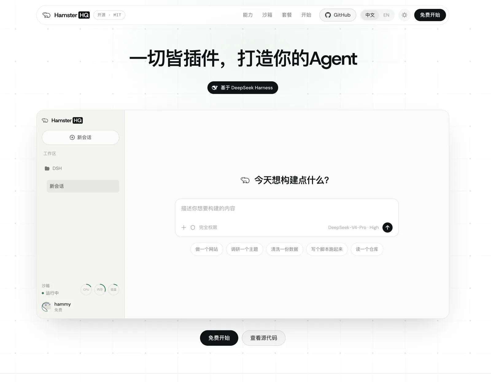

# HamsterHQ

[English](README.md) | 中文

项目主页：**<https://huchundong.github.io/HamsterHQ/>** — 一页看懂它是什么。

项目介绍：[微信公众号文章](https://mp.weixin.qq.com/s/lDd3rK6syoCB7TANxwCRsQ)

> [!IMPORTANT]
> **独立项目声明：** HamsterHQ 是独立开发维护的非官方项目。**HamsterHQ 与 DSH
> 不是同一家公司或组织的产品。** 本仓库不隶属于、不代表，也未获得 DeepSeek AI、
> GitHub 上的 `deepseek-ai` 组织、腾讯云、DSH 或 CubeSandbox 维护方的赞助、背书或
> 维护。文中相关名称仅用于说明兼容性和上游依赖；本项目不主张对相关名称、标识或商标
> 享有任何权利。

[DSH](https://github.com/deepseek-ai/deepseek-harness) 的多租户云端部署：一套独立部署的
前端、一个负责认证的网关，以及每位登录用户一个 dsh 后端，各自带一块持久卷。

DSH 本身是依赖，从 npm 安装。除 `web/patch-loopback.mjs` 这一处受构建门禁约束的补丁外，不改 harness。本项目要加给它的东西，一律以 cordis 插件的形式加。



## 架构


四个决策撑起整个设计，其余都由它们推导而来。

**沙箱以出站方式接入。** 租户的后端从不接受连接——它主动拨号连上网关，再经这条 socket 反向
提供 `/api`。于是沙箱不需要入站可达性、不需要发布端口、也不需要改动 dsh 默认的环回绑定；而
隧道上每一个 stream id 都由网关分配，这让「寻址到另一个租户的流」根本无法被表达，而不只是被
禁止。它同时保住了那些被钉死在环回的配置接口——`settings.*`、`credentials.*`、
`agentPreset.*`——因为隧道客户端把每个请求经沙箱自身的环回接口重放。

**网关是唯一的认证边界。** dsh 自身不带认证，而它背后的 agent 以租户的名义、以完全权限执行
shell 命令。`/api` 之下的每一个请求，HTTP 与 WebSocket 一样，都要先解析出会话才可能触达隧道。
签名 JWT 让会话存储不出现在热路径上；而真正让「撤销」成立的，是 Postgres 里那个会轮换的
不透明 refresh token。

**占用模型是一个进程一个租户。** dsh 没有租户概念——它的 `/api` 是单占的，会话存储是进程级
的——所以把两个租户复用进一个后端属于正确性缺陷，而非优化。因此隔离就是机器隔离：CubeSandbox
下是一台微虚机，Docker 模拟下是一个容器。

**每个租户花自己的模型密钥，而谁都拿不到它。** 部署指定一条模型路由；每个租户在注册时从运维灌入的
密钥池里认领一把，于是花销可归属、可封顶，而本项目不必自己跑一套计费。CubeSandbox 下沙箱持有的是
占位符，由 CubeEgress 在请求出站途中把**该租户的**真实密钥替换进 `Authorization` 头。沙箱的环境、
文件系统、进程表里的任何东西，都可能被提示词注入读走；而一个从来不在那里的密钥不会。

两道接缝让上述决策保持可移植：

- **运行时接缝。** `cube` 与 `docker` 的区别仅在于机器如何被创建和回收。接缝之上的一切在两者
  之间没有任何变化——恰恰是因为沙箱主动向外拨号，上层任何组件都不需要一条打进去的路由。
- **组合接缝。** DSH 是 npm 依赖，版本钉住，除 `web/patch-loopback.mjs` 外不改。本项目加给
  它的东西——隧道、远端宿主面、租户账户、右侧 artifact 面板、品牌——都是从 profile 按包名
  解析的 cordis 插件。升级 harness 就是改一个版本号，再跑一遍验收。

每一条背后的推理、以及它们取代了什么方案，见 [docs/design.zh.md](docs/design.zh.md)。
一路上踩过什么坑——现象、测量值，以及最先得出的那个错误结论——见
[docs/sandbox-pitfalls.zh.md](docs/sandbox-pitfalls.zh.md)。

## 仓库结构

```
Dockerfile              全部镜像，共用一次 npm install
compose.yml             整套栈，附 CubeSandbox 与正式 TLS 的 overlay

gateway/                网关镜像——会话、账号、路由
admin/                  运营控制台——独立镜像、独立端口、独立凭据；与网关共用模块，
                        但够不到任何沙箱
web/                    web 镜像——nginx、落地页，以及采集出的前端外壳
sandbox/                沙箱镜像——入口，以及 dsh 组合增加与剥离了什么

packages/               本仓库拥有的 npm 包
  tunnel-protocol/        隧道两端共用的帧协议
  dsh-gateway-tunnel/     cordis 插件：把沙箱的 /api 流量送出去
  dsh-sandbox-host/       cordis 插件：后端在另一台机器上时浏览器需要的东西——
                          上传，以及配置文件被读出来而不是被打开
  dsh-tenant-account/     cordis 插件：谁登录着，以及怎么退出
  dsh-artifact-panel/     cordis 插件：对话旁边的工作区——文件、预览、终端、画布
  dsh-brand/              cordis 插件：外壳内部这套部署自己的标识
  dsh-icons/              给那些没法向外壳要图标的界面用的一套图标
  dsh-ground/             网关页面与落地页共同站着的那张网格

integrations/           独立存在，抽走不需要改这里一行
  cube-volume-juicefs/    基于 JuiceFS over S3 的 CubeSandbox VolumePlugin

docs/                   设计、品牌，以及沙箱上会踩到的坑
verify/                 验收套件——需要一套真实部署
scripts/                仓库门禁——`npm run check` 跑完整份清单
dev/                    开发用信箱，好让验证码有地方送达
vendor/                 第三方构建产物；许可与来源见 NOTICE
```

[AGENTS.zh.md](AGENTS.zh.md) 是开发约定：DSH 保持为依赖（除那一处受门禁约束的环回补丁外
不改），加给它的一切都是 cordis 插件，上面每个目录只收该收的东西。

`SANDBOX_RUNTIME` 选择运行时：`cube` 是
[CubeSandbox](https://github.com/TencentCloud/CubeSandbox)，每个租户拿到一台微虚机；
`docker` 是一台笔记本就能跑的模拟。

## 运行

```sh
cp .env.example .env      # set SESSION_SECRET, POSTGRES_PASSWORD, RESEND_API_KEY
docker compose --profile build build
docker compose up -d
open http://localhost:8080
```

这是 Docker 模拟：一个租户一个容器，全在一台机器上，除了 Docker 什么都不用装。上面三个变量
是 `.env.example` 里的必填块，缺了栈会拒绝启动。沙箱镜像会被构建但不由 compose 启动——网关
按租户各起一个——所以登录后的第一个请求要等那个容器和 dsh 起来。

**生产跑的是另一套运行时**：CubeSandbox 下每个租户一台微虚机，模型密钥能被扣在沙箱之外也
靠它。那需要另外装好 CubeSandbox，见 [docs/cubesandbox.zh.md](docs/cubesandbox.zh.md)。

一套部署的对外门面——没有会话的人访问 `/` 会看到什么、它怎么构建、标识从哪来——见
[docs/landing.zh.md](docs/landing.zh.md)。

## 验证

```sh
npm run verify        # Docker 模拟；另一套运行时见 docs/cubesandbox.zh.md
```

两个租户登录，套件检查这套部署存在的意义所在：未认证的调用被拒、每个租户拿到各自的沙箱、
彼此够不到对方的会话，以及一次真实模型轮次在真实浏览器里完成。它会消耗真实的模型 token
并删除所有沙箱，所以绝不要对着有人在用的部署跑。各套件分别为捕捉什么而存在，见
[docs/design.zh.md](docs/design.zh.md#验证)。

## 已知限制

- **会话能挺过网关重启，沙箱不能。** 因为会话存放在 Postgres 中，重新部署后登录状态仍在，
  但所有沙箱会在启动时被回收。开启 volume 时，租户的文件与历史会随下一个沙箱回来，丢失的
  只是正在进行的那次对话。
- **网关只能单副本。** Postgres 移除的是网关的磁盘状态，而不是状态本身：活着的隧道是沙箱
  拨向某一个进程的 WebSocket，第二个副本服务不了沙箱连在第一个副本上的租户。
- **邀请码是持有即有效的凭据。** 任何拿到未使用码的人都能注册，包括被转发到的那个人。它是
  一次性的，并记录下用掉它的地址——这让事情在事后可见，而不是事前不可能。
- **撤销最多有十五分钟延迟。** access token 是网关只验签、不查库就能确认的 JWT，这正是
  `/api` 不必碰存储的原因。退出登录、停用与删除都会立刻撤销 refresh token，账号因此无法
  续期——但已经在浏览器里的那个 token 会走完它的有效期。
- **Docker 模拟就是模拟。** 它不持久化任何东西；模型密钥也就摆在沙箱的环境里、agent 读得到
  ——容器前面没有 CubeEgress 把它补回去。
- **网关持有 Docker socket**，等价于宿主机 root 权限。这正是网关不运行任何租户代码、且不
  暴露任何认证请求可操控之物（除启动该租户自己的沙箱之外）的原因。

## 许可

MIT，见 [LICENSE](LICENSE)。随本项目再分发的第三方材料列在 [NOTICE](NOTICE)，许可全文在
[`licenses/`](licenses/)。`web/landing/fonts/` 里的字体（Host Grotesk、DM Sans、
Fragment Mono）采用 [SIL Open Font License](https://openfontlicense.org)；
`packages/dsh-icons/` 里的图标来自上游 harness（MIT）与 lucide-static（ISC；其中
`terminal`、`minimize-2`、`log-out` 另受 Feather 的 MIT 约束）。

## 上游项目与致谢

HamsterHQ 依赖以下上游项目，并感谢其维护者与贡献者：

- [DeepSeek Harness（DSH）](https://github.com/deepseek-ai/deepseek-harness)：本项目作为
  npm 依赖安装的上游 agent harness。DSH 采用 [MIT License](https://github.com/deepseek-ai/deepseek-harness/blob/master/LICENSE)。
- [CubeSandbox](https://github.com/TencentCloud/CubeSandbox)：用于提供每租户隔离能力的
  可选微虚机沙箱运行时。CubeSandbox 主体采用
  [Apache-2.0，并在其许可文件中列出第三方组件许可](https://github.com/TencentCloud/CubeSandbox/blob/master/LICENSE)。

各上游项目仍由其各自的维护者管理，并遵循各自的许可条款。此处致谢不表示任何隶属、
赞助、背书或共同所有关系。
